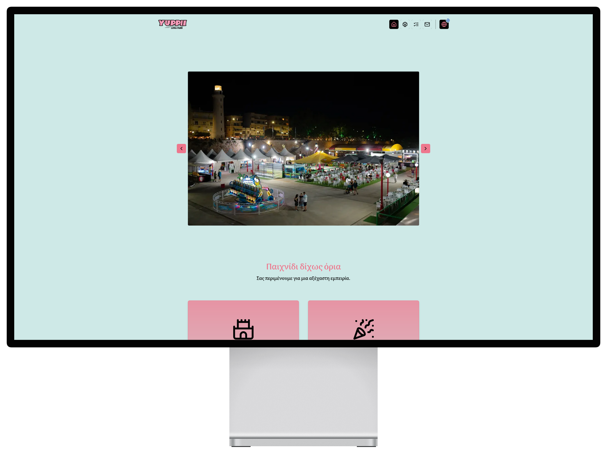
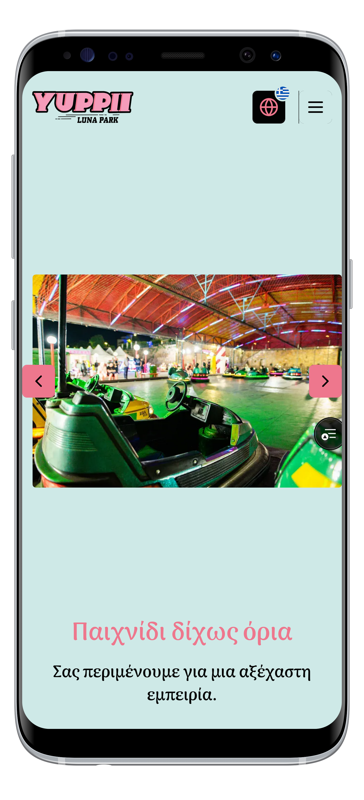

# yuppii_next

Repo of the Yuppii Luna Park website.
You can take a look at the website [here](https://yuppii.gr).

  

    <h4>Desktop View</h4>
    
  

  

    <h4>Mobile View</h4>
    
  

**Core project tools:**

- [Next.js](https://nextjs.org/) as the meta-framework of choice
- [Tailwind CSS](https://tailwindcss.com/) for all styling purposes
- [next-intl](https://next-intl-docs.vercel.app/) as the internationalization solution
- [Radix UI](https://www.radix-ui.com/primitives) for its accessible, unstyled primitives
- [shadcn/ui](https://ui.shadcn.com/) as a reference on the implementation of components
- [Leaflet](https://leafletjs.com/) JavaScript library for mobile-friendly interactive maps
- [React Leaflet](https://react-leaflet.js.org/) components for Leaflet maps
- [Lucide](https://lucide.dev/) a rich React icons library
- [Valibot](https://valibot.dev/) schema & data validation library
- [Resend](https://resend.com/home) API for sending transactional emails
- [RHT](https://react-hot-toast.com/) beatiful toast notifications library
